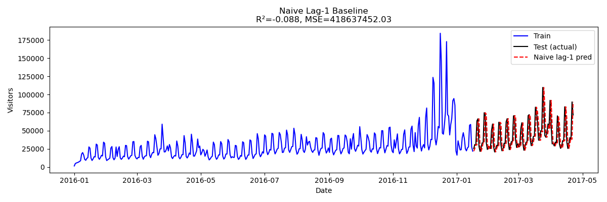
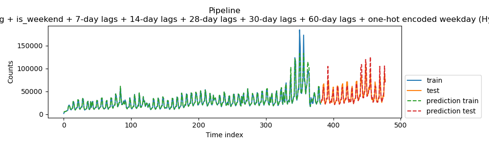
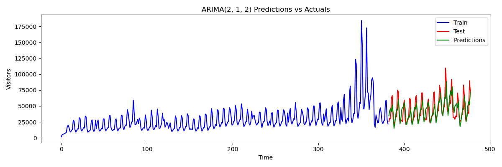
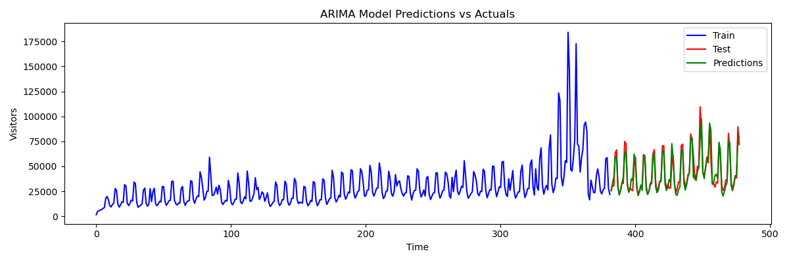
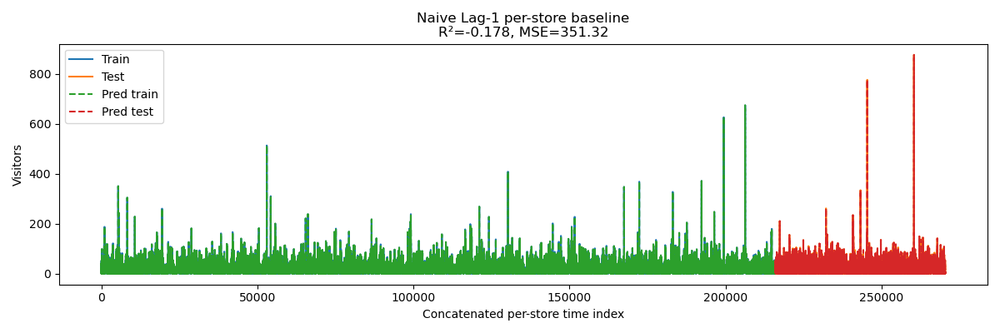
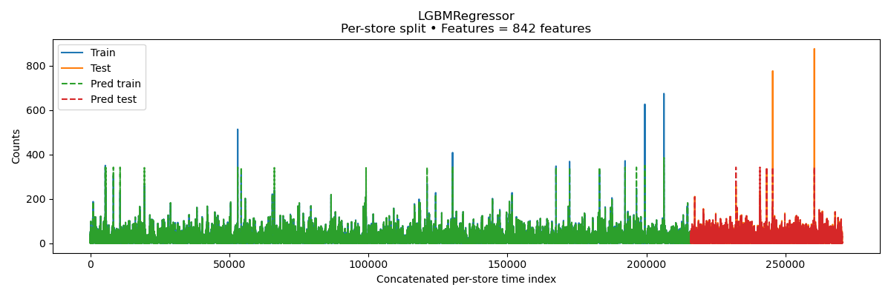

# Forecasting-Restaurant-Visitor-Demand-with-Machine-Learning

This project tackles the Recruit Restaurant Visitor Forecasting challenge released in November of 2017, where the goal is to predict the number of future visitors to restaurants across Japan. Since the target is daily visitor counts, this is framed as a time series forecasting problem.

The dataset is lightweight and beginner-friendly, coming from two major Japanese platforms:
	•	Hot Pepper Gourmet (hpg): similar to Yelp (search and reservations)
	•	AirREGI / Restaurant Board (air): similar to Square (reservation management and POS data)

Data spans from January of 2016 until April of 2017 for training, with the test set covering late April to May 2017. The test period includes Japan’s Golden Week, a national holiday week that heavily impacts restaurant traffic.

**NOTE:** Days when restaurants were closed are excluded from the training set, and test days with closures are not considered in the scoring.

## Repository Structure

````
├── data/             # CSV datasets (air_visit_data, reserves, date_info, store info, etc.)
├── notebooks/        # Exploratory and modeling Jupyter notebooks
├── src/              # Custom scripts (feature engineering, model wrappers, etc.)
├── reports/          # Results: figures, evaluation metrics, presentations
├── Makefile          # Commands to run and export notebooks
├── requirements.txt  # Python dependencies
└── README.md         # Project overview
````

##  Methodology

1. **Feature Engineering**  
   - Aggregated daily visitors per store.  
   - Generated lag features (1d, 7d, 14d, 28d) and global rolling means.  
   - Included calendar features: month, day-of-week, holiday flags.  

2. **Baseline Models**  
   - *Naïve lag-1*: predict today = yesterday.  
   - *Last-7 mean*: predict using the average of the previous week.

3. **Nested Evaluation Strategies**  
   - **Statistical**: ARIMA / SARIMAX optimized with minimalistic walk-forward forecasting.  
   - **Machine Learning**:  
     - Trained LightGBM models using per-store OHE, lags, and calendar features.  
     - Evaluated with chronological train-test splits and weekly-aggregated plots for clarity.  
     - Implemented hyperparameter tuning via `RandomizedSearchCV` with `TimeSeriesSplit`.

4. **Leakage Checks**  
   - Ensured lag features are properly shifted (no leakage of future data).  
   - Proper train-test splits per store and per model to prevent any lookahead bias.

---

##  Results Summary

| Model                | Test R²  | RMSE         |
|----------------------|----------|--------------|
| Naive Lag-1 Baseline (Global model) | ~-0.09    | ~20000 |
| LightGBM optimized (Global model) | ~-0.82    | ~8400 |
| Naive Lag-1 Baseline (Per-store model) | ~-0.18    | ~19 |
| LightGBM (Per-store model) | ~0.97    | ~3 |
| ARIMA optimized                | ~0.43    | ~15000          |
| SARIMAX optimized              | ~0.85    | ~7250         |

## Plots

### Baseline global


The figure above shows the results of a Naive Lag-1 baseline model, which simply uses the previous day’s visitor count as the prediction for the next day. While this approach captures some short-term patterns, it fails to account for seasonality and sudden spikes, resulting in poor performance (R² = -0.088, MSE ≈ 41.9M). The blue line represents the training data, the black line shows the actual values in the test set, and the red dashed line corresponds to the naive predictions. This baseline serves as a simple benchmark: any advanced forecasting model such as SARIMAX or LightGBM should outperform it in order to justify added complexity.

### LightGBM optimized global


The plot above shows the performance of the LightGBM optimized global model, which leverages multiple lag features (7, 14, 28, 30, and 60 days), weekend indicators, and one-hot encoded weekdays. Unlike the naive baseline, this model successfully captures both weekly and seasonal patterns, producing much closer fits to the actual visitor counts in both training and test sets (Test R^2 = 0.82, RMSE = ~8400). The green and orange lines represent the observed values, while the dashed lines correspond to model predictions. This demonstrates how tree-based gradient boosting, when combined with engineered temporal features, can substantially improve forecasting accuracy compared to naive approaches.

### ARIMA optimized


The figure above presents the results of the ARIMA(2,1,2) optimized model, which is a traditional statistical time-series approach designed to capture autocorrelation and trends in visitor counts. While ARIMA provides a smoother forecast compared to the naive baseline, it struggles to adapt to the sharp spikes and complex seasonal variations present in the data. In the plot, the blue line shows the training data, the red line represents the actual test values, and the green line shows the ARIMA predictions. Although the model aligns reasonably well with the general trend, its limited ability to handle strong seasonality and abrupt changes highlights the need for more flexible models such as SARIMAX or machine learning approaches like LightGBM.

### SARIMAX optimized


The plot above shows the performance of the SARIMAX(2,1,2)(1,1,1,7) optimized model, which extends ARIMA by incorporating seasonality and exogenous components. Compared to plain ARIMA, SARIMAX is better able to capture the repeating weekly and seasonal patterns in visitor counts, resulting in predictions (green line) that more closely align with the actual test values (red line). While the model handles cyclical trends reasonably well, it still struggles with abrupt spikes and irregular variations, which limits its accuracy in highly volatile periods. This demonstrates the trade-off between traditional statistical models, which offer interpretability and structured handling of seasonality, and machine learning approaches like LightGBM, which can better adapt to complex nonlinear patterns.


### Baseline per-store


The figure above shows the Naive Lag-1 baseline applied at the per-store level, where each restaurant’s visitor history is modeled independently. In this approach, the prediction for each store is simply the previous day’s visitor count, concatenated across all stores for evaluation. As shown, the predictions (dashed lines) roughly track short-term fluctuations but fail to capture broader seasonality or sudden spikes in demand, resulting in poor accuracy (R² = -0.178, MSE ≈ 351.3). This highlights the limitations of naive models even at the per-store level and provides a simple benchmark against which more sophisticated per-store forecasting methods (e.g., LightGBM with store-specific features) can be compared.

### LightGBM per-store


The plot above illustrates the performance of the per-store LightGBM model, where each restaurant is modeled independently with a rich set of engineered features (842 total, including multiple lag variables, rolling statistics, and calendar effects). Compared to the naive per-store baseline, this approach achieves a much tighter fit to both training and test data (Test R^2=0.97, RMSE=~3), capturing short-term dynamics and seasonality more effectively across different stores. The dashed lines show the model’s predictions, which align closely with observed visitor counts, especially in the test set. This demonstrates how machine learning with carefully designed temporal and categorical features can significantly improve per-store forecasting accuracy over simple lag-based benchmarks.

**Key takeaway:** Adding per-store identity and lag features significantly boosts accuracy. Good models should beat the naïve baseline for validation.

---

##  Usage

1. Install dependencies:
   ```bash
   pip install -r requirements.txt

2.	Explore:
	- /notebooks/ – description, feature exploration, modeling workflow.
	- /reports/ – plots of predictions, residuals, and performance summaries.

## Potential Next Steps
- Build a store-holdout validation to test generalization to unseen restaurants.
- Explore neural time-series models (e.g. Prophet, LSTM, NHITS).
- Include external signals like weather, local events, or holidays beyond Golden Week.